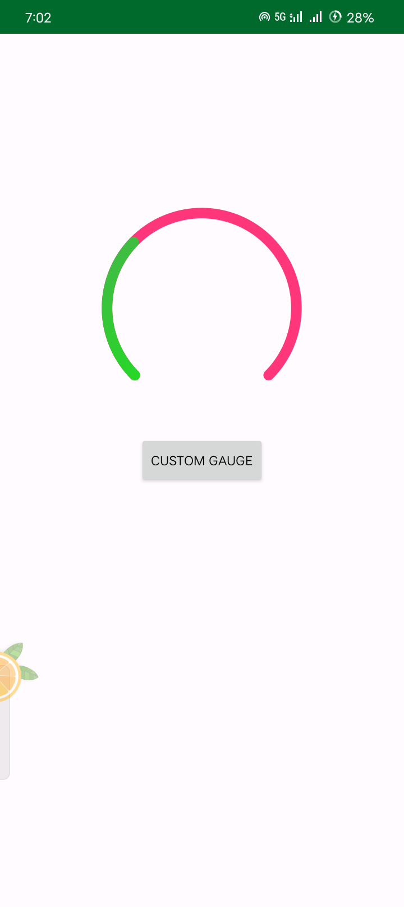

# Gauge-Library-Android

A custom gauge library for Android, where developers can easily implement meters and gauges in XML UI. This library is written in Kotlin and is inspired by and forked from the discontinued [CustomGauge](https://github.com/pkleczko/CustomGauge), a Java library that was previously hosted on JCenter.

[](https://jitpack.io/#codersalman/Gauge-Library-Android)

## Features
- **Simple integration:** Easily add gauge and meter UI elements directly in your XML layouts.
- **Kotlin-based:** Written in modern Kotlin, ensuring compatibility with current Android projects.
- **Lightweight:** Optimized for performance and efficient UI rendering.

## Installation

### Step 1: Add the JitPack repository to your build file

In your root `build.gradle` file, add the following at the end of the `repositories` section:

```gradle
dependencyResolutionManagement {
    repositoriesMode.set(RepositoriesMode.FAIL_ON_PROJECT_REPOS)
    repositories {
        mavenCentral()
        maven { url 'https://jitpack.io' }
    }
}
```

### Step 2: Add the dependency
Add the following dependency to your module-level `build.gradle` file:

```gradle
dependencies {
implementation 'com.github.codersalman:Gauge-Library-Android:0.0.1'
}
```

Add the following dependency to your module-level `build.gradle.kts` file:

```kotlin
    dependencies {
        implementation("com.github.codersalman:Gauge-Library-Android:0.0.1")
    }
 ```

## Attributes
### Available View Attributes

The following attributes can be used to customize the gauge view in your Android project:

- `startAngel` (float): The left start angle in degrees. The gauge is drawn as an arc starting from `startAngel` (where to start) with `sweepAngel` (how many degrees the arc spans). The drawing is clockwise, with 0 degrees at the right, 90 at the bottom, 180 at the left, and 270 at the top. For example, to create a full circle starting at 90 degrees, set `startAngel` to 90 and `sweepAngel` to 360.
- `sweepAngel` (float): Defines how many degrees the arc should span, starting from `startAngel`.
- `startValue` (int): The start value of the scale.
- `endValue` (int): The end value of the scale.
- `strokeWidth` (float): Defines the width of the stroke.
- `strokeColor` (color): The color of the stroke (must be a resource color and cannot be a selector).
- `strokeCap` (enum): The style of the circle stroke. Options:
    - `BUTT`: Straight ends of the stroke.
    - `ROUND`: Rounded ends of the stroke.
- `pointSize` (float): Defines the width of the pointer. If not set, the pointer is drawn from the `startValue` to the current value.
- `pointStartColor` (color): The start color for the gradient pointer.
- `pointEndColor` (color): The end color for the gradient pointer.
- `dividerSize` (float): Defines the size of dividers relative to the scale. For example, if your start value is 50 and end value is 120, and `dividerSize` is set to 2, the divider will occupy 1/35th of the gauge's total width (i.e., 2 points on the scale).
- `dividerStep` (int): Defines how often the dividers are drawn, in percentage values. For example, setting `dividerStep` to 20 will draw dividers every 20% of the scale, resulting in 6 dividers (including the first and last).
- `dividerColor` (color): The color of the dividers.
- `dividerDrawFirst` (boolean): Determines whether to draw the first divider.
- `dividerDrawLast` (boolean): Determines whether to draw the last divider.

These attributes give you full control over the appearance and behavior of the gauge in your layout.


### Kotlin

Add the following Kotlin code to your activity file:
```kotlin
private var gauge: Gauge? = null

val gauge = findViewById<Gauge>(R.id.gauge1)

gauge?.apply {
    sweepAngle = 270

}
```


### XML

Add the following XML code to your layout file:
```xml
 <com.imsalman.gaugelibrary.Gauge
        android:id="@+id/gauge1"
        android:layout_width="200dp"
        android:layout_height="200dp"
        android:paddingBottom="20dp"
        android:paddingLeft="20dp"
        android:paddingRight="20dp"
        android:paddingTop="20dp"
        android:layout_marginTop="160dp"
        android:layout_gravity="center"
        app:gaugePointStartColor="#4CAF50"
        app:gaugePointEndColor="#00ff00"
        app:gaugePointSize="89"
        app:gaugeStartAngle="135"
        app:gaugeStrokeCap="ROUND"
        app:gaugeStrokeColor="#FF367A"
        app:gaugeStrokeWidth="10dp"
        app:gaugeStartValue="0"
        app:gaugeEndValue="1000"
        app:gaugeSweepAngle="270"
        />
```

### Screenshots



### License
```
MIT License
This project is licensed under the MIT License. See the LICENSE file for details.


```

